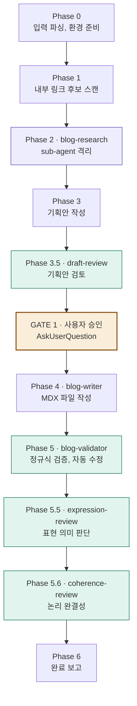

# tech-blog

AI가 글을 쓰고, 개발자가 방향을 잡는 한국어 기술 블로그.

궁금한 주제를 AI에게 던지면 코드 예제와 인터랙티브 요소를 담은 글이 생성됩니다.
직접 쓰는 대신, 어떤 주제를 어떻게 다룰지 큐레이션하는 데 집중합니다.

---

## 작동 방식

이 블로그는 글 작성을 단순히 "AI에게 주제 던지기" 수준이 아니라, **10개의 전용
스킬로 구성된 파이프라인**으로 처리합니다. 각 스킬이 한 가지 책임을 맡고,
오케스트레이터 (`blog-write`) 가 순서를 조율합니다.

핵심 원칙:

- **SSOT (Single Source of Truth)**: 모든 글쓰기 규칙은 `SHARED.md` 한 곳에
  정의되고, 각 스킬은 이를 참조합니다. 규칙 중복 없음.
- **계층화된 검증**: 기획 검토 → 정규식 검증 → 표현 의미 판단 → 논리 완결성
  검토, 4개 층이 순차적으로 글을 점검합니다.
- **사용자 게이트는 한 곳만**: 기획안 단계에서 사용자가 한 번 승인하면, 이후
  작성·검증은 자동입니다.
- **메타 관리**: 규칙이나 스킬 자체를 다듬는 별도 스킬 (`blog-rule-editor`) 이
  안전 장치와 함께 제공됩니다.
- **글 다듬기**: 기존 글을 수정하는 별도 스킬 (`blog-revise`) 이 5가지 패턴
  (재검증/부분 수정/자료 보강/완전 재작성/분석만) 을 지원합니다.
- **배너 자동화**: 포스트 배너 모티프를 태그 기반으로 추천하고 필요 시 새 SVG 를
  생성하는 별도 스킬 (`blog-banner`) 이 있습니다.

## 빠른 시작

### 글 작성

```bash
# Claude Code 에서 프로젝트 루트로 진입
/blog-write CSS aspect-ratio 사용법

# URL 함께 제공 가능
/blog-write React Suspense 동작 원리 https://react.dev/reference/react/Suspense
```

오케스트레이터가 자료 수집부터 검증까지 자동 진행하고, 기획안 단계에서 한 번
사용자 승인을 받습니다.

### 기존 글 다듬기

```bash
# 파일만 지정 (다듬기 패턴 카탈로그 제시)
/blog-revise content/posts/css-aspect-ratio.mdx

# 의도와 함께
/blog-revise content/posts/css-aspect-ratio.mdx 마무리 단락이 어색해
/blog-revise content/posts/css-aspect-ratio.mdx 새 자료 추가가 필요해
/blog-revise content/posts/css-aspect-ratio.mdx 뭐가 문제인지 분석만
```

5가지 패턴 (재검증/부분 수정/자료 보강/완전 재작성/분석만) 을 지원하고, 자동 백업과
검증 사이클이 포함됩니다.

### 규칙 수정

```bash
/blog-rule-editor

# 또는 구체 요청
/blog-rule-editor §RULE-HYPE 에서 "간편한" 빼줘
```

자세한 사용법은 [AGENTS.md](./AGENTS.md) 참조.

## 파이프라인 흐름

`blog-write` 오케스트레이터는 7개의 Phase 를 순차적으로 실행합니다.



각 Phase 의 책임:

| Phase  | 스킬                     | 역할                                                     |
| ------ | ------------------------ | -------------------------------------------------------- |
| 0      | (오케스트레이터)         | 입력 파싱, content/tmp 준비, 누적 실패 로그 확인         |
| 1      | (오케스트레이터)         | content/posts/ 에서 관련 글 grep, 내부 링크 후보 추출    |
| 2      | `blog-research`          | sub-agent 로 격리 실행, 자료 수집, 1순위/2순위 출처 분류 |
| 3      | (오케스트레이터)         | 자료 기반 기획안 작성 (제목 후보, 섹션 구조, 자료 매핑)  |
| 3.5    | `blog-draft-review`      | 기획안 검토 (자료 충분성, 복잡도, 제목, 섹션, 링크)      |
| GATE 1 | (오케스트레이터)         | 사용자 승인 — `AskUserQuestion` 클릭 UI                  |
| 4      | `blog-writer`            | MDX 파일 작성, Step 1~9 자가 체크리스트                  |
| 5      | `blog-validator`         | 정규식 검증 + 자동 수정, velite 빌드                     |
| 5.5    | `blog-expression-review` | 어조, 호흡, 메타 문장, 자기 목소리 등 표현 검토          |
| 5.6    | `blog-coherence-review`  | 도입-결론 호응, 섹션 흐름, 모순 등 논리 완결성           |
| 6      | (오케스트레이터)         | validator 와 리뷰어 전체 리포트, 다음 단계 안내          |

기존 글을 다듬는 흐름은 별도 스킬 `blog-revise` 가 담당합니다. 5가지 패턴 (재검증
/부분 수정/자료 보강/완전 재작성/분석만) 을 지원하며, 내부적으로 위 파이프라인의
일부 (validator, 리뷰어들, 또는 blog-write 전체) 를 재사용합니다. 자세한 내용은
[AGENTS.md](./AGENTS.md) 의 "시나리오 6: 기존 글 다듬기" 참조.

## 스킬 패밀리

`.claude/skills/` 하위에 10개 스킬과 SSOT 저장소 (`blog-shared`) 가 있습니다.

```
.claude/skills/
├── blog-write/                ← 오케스트레이터 (새 글 작성)
├── blog-revise/               ← 오케스트레이터 (기존 글 다듬기)
├── blog-research/             ← 자료 수집 (sub-agent)
├── blog-writer/               ← 집필
├── blog-validator/            ← 정규식 검증 + 자동 수정
├── blog-draft-review/         ← 기획안 검토
├── blog-expression-review/    ← 표현 의미 판단
├── blog-coherence-review/     ← 논리 완결성
├── blog-rule-editor/          ← 메타 관리
├── blog-banner/               ← 배너 모티프 추천 + SVG 생성
└── blog-shared/
    ├── SHARED.md              ← SSOT (모든 규칙)
    ├── config/domains.md      ← 도메인 화이트리스트
    ├── CHANGELOG.md           ← 자동 생성
    └── .backups/              ← 자동 생성

content/
├── posts/
│   └── .backups/              ← blog-revise 자동 생성 (gitignored)
└── tmp/
    └── .gitkeep
```

각 스킬의 상세 역할과 호출 관계는 [AGENTS.md](./AGENTS.md) 의 "스킬 관계"
섹션을 참조하세요.

## 검증 층위

블로그 글은 4개 층의 검증을 거칩니다. 각 층은 독립적이며 다른 측면을 봅니다.

| 층   | 스킬                | 검사 대상                                      | 자동 수정                  | 시점              |
| ---- | ------------------- | ---------------------------------------------- | -------------------------- | ----------------- |
| 기획 | `draft-review`      | 자료 충분성, 복잡도, 제목, 섹션, 링크          | 부분 (오케스트레이터 액션) | writer 호출 전    |
| 표면 | `validator`         | em-dash, 콜론, JSX prop, 인용, References      | 전부                       | writer 직후       |
| 표현 | `expression-review` | 병렬 삼단, 과장, 메타, 어미, 호흡, 자기 목소리 | 부분 (메타·어미·호흡)      | validator 통과 후 |
| 논리 | `coherence-review`  | 도입-결론, 섹션 흐름, 근거, 모순               | 거의 없음 (사용자 확인)    | 마지막            |

층이 독립적이라 한 층이 결함을 놓쳐도 다른 층이 잡아줍니다. 이 분리는 의도적입니다:
정규식으로 잡을 수 있는 것 (validator) 과 의미 판단이 필요한 것 (리뷰어들) 을 섞으면
역할이 모호해지고 토큰 비용이 늘어납니다.

## SHARED.md SSOT 구조

`blog-shared/SHARED.md` 는 모든 글쓰기 규칙의 단일 출처입니다. 각 스킬은 필요한
섹션을 Read 로 주입받아 참조하며, 규칙을 자기 파일에 복사하지 않습니다.

주요 섹션:

- **§BLOG-VOICE** — 어조 정의 (구어 존댓말 70% 이상, 반말 문어체 금지)
- **§SOURCE-PRIORITY** — 출처 우선순위 (1순위 공식 문서, 4순위 블로그)
- **§META-TITLE / §META-DESCRIPTION** — 제목/설명 품질 기준
- **§COMPLEXITY** — 단편/시리즈 판단
- **§FRONTMATTER / §FILE-LAYOUT** — 파일 구조
- **§MDX-CODEPLAYGROUND** — 코드 컴포넌트 사용 규칙
- **§RULE-\* (10여 개)** — em-dash, 콜론, bold, bare 리스트, 인용, 병렬 삼단,
  과장 형용사, 메타 문장, 호흡, 자기 목소리 등 글쓰기 금지/권장 패턴
- **§DOMAIN-WHITELIST** — 신뢰 가능 도메인 (`config/domains.md` 로 분리)
- **§UI-USER-CHOICE** — 사용자 선택지는 항상 `AskUserQuestion` 툴 호출

규칙을 수정하려면 `blog-rule-editor` 를 사용하세요. 직접 SHARED.md 를 편집하는
것보다 안전합니다 (백업 + 영향 범위 분석 + CHANGELOG 자동 기록).

## 메타 관리: blog-rule-editor

블로그 스킬 패밀리 자체를 관리하는 전용 스킬입니다. 안전 장치 7개를 거쳐 SHARED.md,
config, 개별 스킬 파일을 수정합니다.

지원 작업:

- 규칙 수정 (SHARED.md §RULE-\* 추가/제거/완화)
- config 파일 편집 (domains.md 등)
- 스킬 파일 Phase/Step 수정
- 새 스킬 추가
- writer 실패 로그 (`content/tmp/writer-failures.md`) 패턴 분석
- 백업 정리 (30일 이상)

자세한 작업 카탈로그는 `/blog-rule-editor` 실행 후 확인.

## 디렉토리 구조

```
.
├── .claude/
│   └── skills/                  ← 블로그 스킬 패밀리 (10개 + blog-shared)
├── content/
│   ├── posts/                   ← MDX 글 (글 작성 출력)
│   │   └── .backups/            ← blog-revise 백업 (gitignored)
│   └── tmp/                     ← 로컬 로그 (gitignored)
│       ├── .gitkeep
│       └── writer-failures.md   ← writer 실패 로그 (자동 생성)
├── README.md                    ← 이 파일
└── AGENTS.md                    ← AI 에이전트 작업 가이드
```

## 기술 스택

- **콘텐츠**: MDX
- **빌드**: velite (스키마 검증 + 빌드)
- **인터랙티브 컴포넌트**: CodePlayground (Sandpack 기반)
- **글 작성 파이프라인**: Claude Code skills (`.claude/skills/`)

## 라이선스

(프로젝트 라이선스 정보)

## 더 알아보기

- 글 작성 작업 가이드: [AGENTS.md](./AGENTS.md)
- 스킬 패밀리 변경 이력: `.claude/skills/blog-shared/CHANGELOG.md` (첫 수정 후 자동 생성)
- 공통 규칙 정의: `.claude/skills/blog-shared/SHARED.md`
